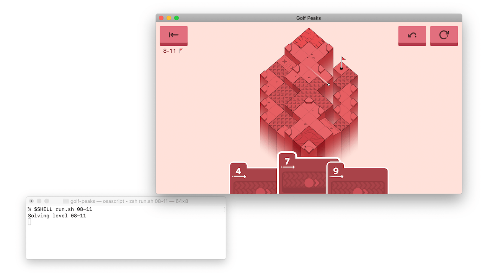
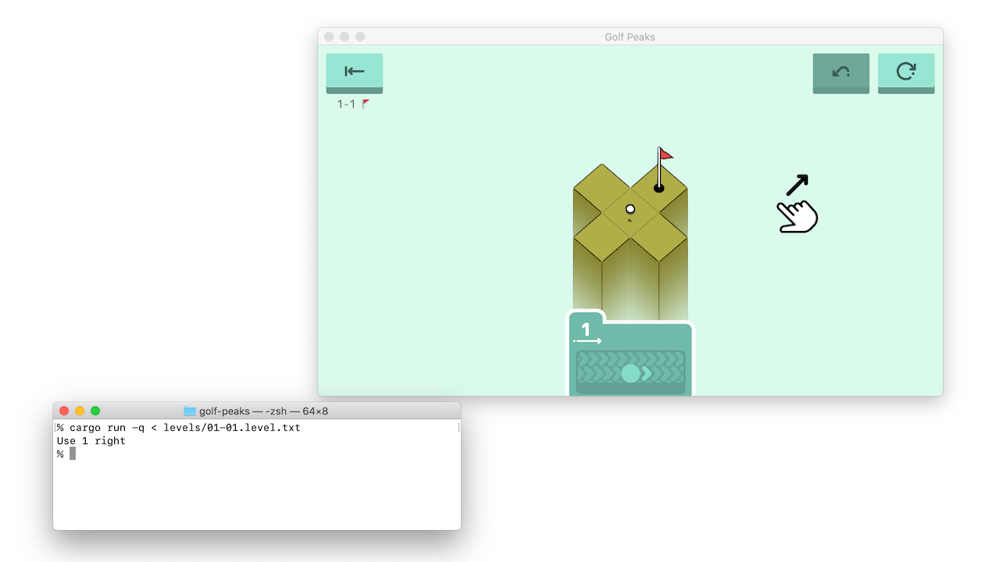
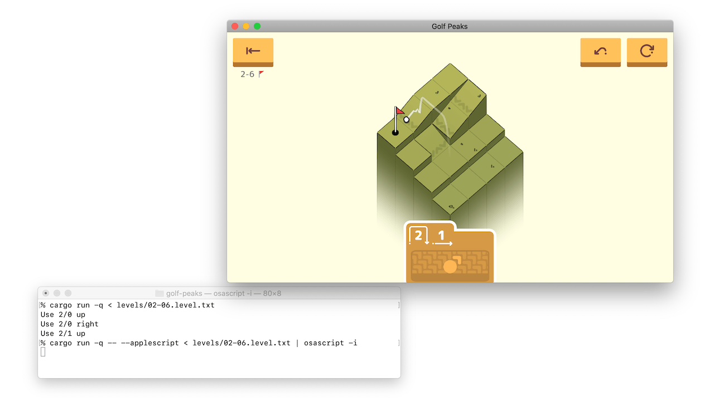
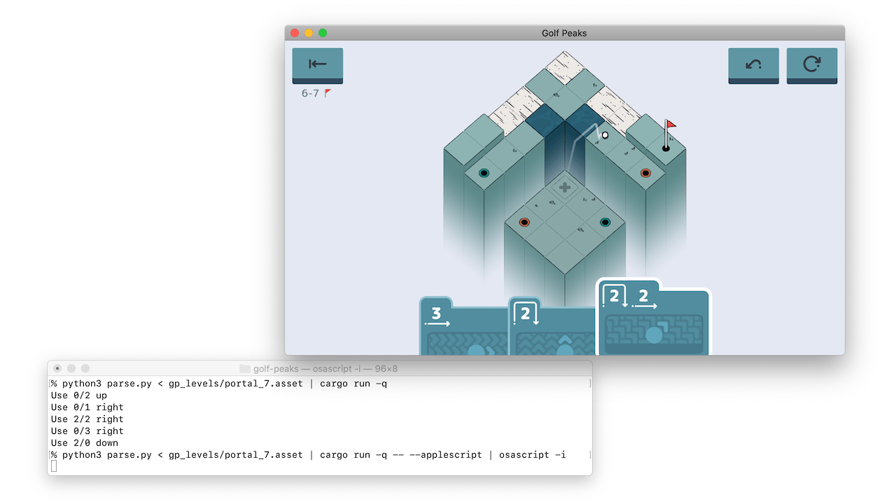
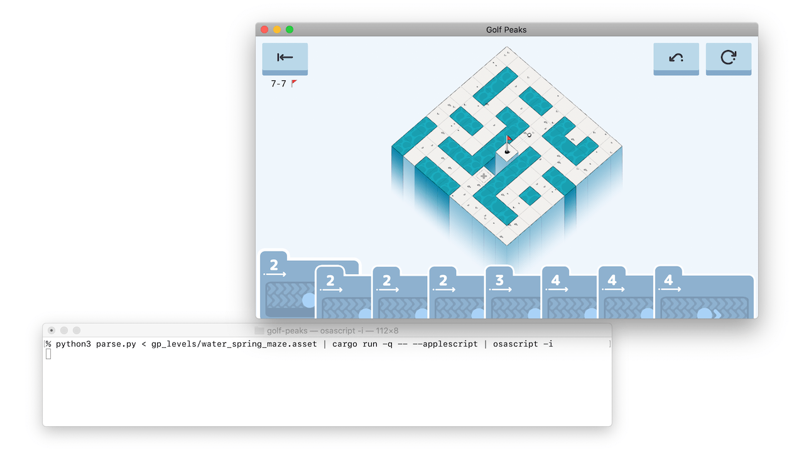

Recently I played [Golf Peaks](https://afterburn.itch.io/golf-peaks), a golf-based puzzler from [Afterburn Games](http://afterburn.games/). I really enjoyed completing all of its levels, so last week I decided to try my hand at building a solver for it.

<!--more-->

If you're interested at glancing through the code for this project, you can find it all on [GitHub](https://github.com/nchlswhttkr/golf-peaks/)!



## A primer on Golf Peaks

Puzzles in Golf Peaks are presented as levels, where the player must move the golf ball to the hole to win. The available moves are presented as cards, which affect how the ball will travel. They might roll the ball along the ground, chip it into the air, or do a combination of the two. By playing their cards in the right order and hitting the ball in the right direction, the player can clear a variety of challenge to complete a level.

As the levels advance, new elements are introduced. The first world introduces slopes, which can redirect a ball. Later worlds introduce further challenges such as water hazards, sand traps and portals. As the levels grow more complex, the player is challenged to carefully consider how they play their cards.

## Proof of concept

The most important step for me in this project was playing and completing the game itself. This helped me get a grasp of the fundamental rules of the game, and how different terrains would affect the ball's movement.

With this in mind, I went about putting all the rules, as I understood them, in writing. Verbalising these rules helped forecast many of the edge cases that would eventually crop up, dictating logic for how the ball should move in various conditions.

With this knowledge in hand, I set out to write a program that would list out the moves needed to solve the first few levels of Golf Peaks. These levels were the most basic, featuring flat ground and a single clear victory path.

I opted to build my solver in Rust, as I had a feeling Rust's pattern matching syntax would be particularly convenient for checking movement conditions. Using a language with strict, compile-time type checks made it easier for me to iterate without unknowingly breaking existing code as well.



After a bit of trial and error, success! The solver was able to burn through the first few levels, all consisting of flat ground. After adding logic to make the ball bounce off walls and navigate slopes, the first world was complete!

## Getting faster feedback

Being able to list out the instructions to solve a level was nice, but it also meant I needed to spend time manually verifying each level's solution. This was when I decided to leverage AppleScript, a scripting language for macOS. I extended my solver to print out the necessary key presses/delays for a level, and piping this into the AppleScript interpreter allowed my system to do all the work, completing levels for me.



After adding in the logic for airborne moves and corners for the ball to bounce off of, I was able to sit back and watch my solver complete the second world!

## Growing pains

So far, I'd been writing out each level by hand into a form my solver could understand. This became quite labourious by the third world, and with upcoming levels consisting of dozens of different tiles it was only going to keep taking me longer and longer to transcribe levels.

I opted to scour through the game's files, trying to see if levels were stored in plain text anywhere with the help of `strings` and `grep`. This search didn't turn up anything unfortunately, because it seemed that Unity bundled all of the game assets into large binary files that I couldn't make sense of.

On a whim, I tried reaching out to the creators through email, sending a recording of my solver in action and asking if they had plain text versions of the level files. The next morning, I woke up to a lovely response from the team!

> _Glad you enjoyed the game :)_ \
> \
> _This project of yours looks pretty cool; in the attachment you'll find all of the level files from the game + a couple of unused extras._

Success! With the level asset files in hand (YAML exports from Unity), I set about writing a parser to convert them into the format my solver expected. This turned up a few interesting discoveries:

-   What was up/north in my solver was actually _west_ in game, so everything had to be rotated in parsing
-   The game builds levels row by row from a sequence of tiles, meaning the starting tile and out-of-bounds areas were actually special types of tiles

It was around this point that I embraced the joy of writing code for this project with the singular goal of "just working", rather than meeting some self-imposed ideal of "clean" or "perfect". If it could read in a level's file and output the commands to complete it, I was good to move on.

With this attitude, I was able to add the logic for sand traps, springs, quicksand, water hazards and portals in an afternoon to bring my solver up to completing the first six worlds.



## Pausing to review

After getting this far, the code was starting to become a bit too messy to deal with. The `try_move()` function find where a move would land a ball had ballooned out monstruously, and featured a tangled sprawl of nested conditions at its heart. I'd worked with the existing code enough to know where it needed improvement, so I decided some rewriting was finally in order.

Now, refactoring can be dangerous if one isn't careful. It's easy to miss edge cases when reimplementing existing logic. I decided the best way to guard against breaking my existing logic was by setting up tests to ensure the target area (`try_move()`) kept behaving as expected.

I ended up with around 30 test cases, checking different behaviours across all sorts of terrains. With the "legacy" `try_move()` function passing all of them (bar one case where I knew the existing code was buggy) I set about changing its internals.

In terms of game logic, I was able to better express how various situations affected the ball's movement, and when the effects of various terrains came into play. For example, the ball needs to check if it lands in water after each step, but only needs to check if it's landed in quicksand once it stops moving completely.

I was also able to make Rust-specific improvements to the solver in the rewrite. I'm still very much learning the language, and I found that re-reading key sections from the Rust book on the [ownership model](https://doc.rust-lang.org/book/ch04-01-what-is-ownership.html) and [derived traits](https://doc.rust-lang.org/book/appendix-03-derivable-traits.html) helped me understand where I was going wrong. With this review, I was able to clean up a lot of unnecessary borrows made by `try_move()`, which had required me to use `clone()` internally.

With my changes made, tests passing, and the new code successfully recompleting the first six worlds, it was time to finish the last four worlds of Golf Peaks.

## Home stretch

Fresh off this refactor, it didn't take long to implement the conveyor belts and ice tiles introduced in the last worlds. With the last special tiles out of the way, all that was left was to test my solver against the remaining levels!

At this point, the file names weren't quite lining up with the level IDs. Thankfully, `grep` came to the rescue, helping me find levels by the set of cards in the players hand! I was able to find most of the levels straight away, except for a few where the order of the cards was different between the source and my release.

```sh
grep -rp "Cards: 0,1;0,1;0,2;0,2;1,0" gp_levels/
```

It was in testing these final levels that my solver started to encounter performance problems.



Up until now, my solver had been performing a fairly naive depth-first search using the available moves, and returning the first successful path it found. While this was fine for levels where the player only had a handful of moves and could easily fall out of bounds, it began to struggle as more cards were made available and levels grew in size.

In the case of this water maze level, my solver wasted a lot of time investigating paths where it would repeatedly hit the ball into the water, only to be placed back on the tile it originated from. This was a quick fix, by forcing paths to be discarded if they contained wasted moves where the ball didn't change positions. Similarly complex levels appeared in the final world as well, but my solver was able to find solutions to these within a few seconds when testing with an optimised build rather than a development build.

I also needed to introduce a guard against getting stuck in an infinite loop, usually involving conveyor belts or ice tiles. With the guard in place though, my solver was able to clear through every level in the game!

As a final bit of polish, I made the solver find a rough measure of how long each step of a solution would take to run. Since it needed to "wait" between moves for the ball to travel and stop, I'd been using a static delay that I increased whenever a level took too long. Introducing a variable estimate for this delay allowed the solver to breeze though shorter levels without needlessly waiting.

With all of this in place, I pointed my solver at Golf Peaks and watched the magic unfold.

{}

## Where to from here?

I'm really happy with where this solver's arrived at, but I can still pick out a few areas for improvement worth considering on a revisit. Maybe another blog post will be here in the near future?

The existing depth-first algorithm can be immediately improved by _ignoring paths that circle back_ to a previous tile. At the moment, the solver will perform poorly on levels with many branching paths and many cards. The most notable example of this is `10-01`, a wide open field which takes a few seconds to solve even on a release build.

It's worth considering applying _memoization_ too, particularly for larger levels with many moves. Between recursive calls, it's fairly likely the most moves will appear more than once.

The solver currently returns the first successful path it finds, _even if better/faster solutions exist_. Trying all paths may yield a solution of fewer moves, which would shave several seconds off execution in game. It's something the test and benchmark though, since trying all paths will also take longer.

A _graph-based algorithm_ is also worth considering. With a little wrangling, a level could be expressed as a weighted, directed graph. Finding a solution is then a matter of finding the cheapest path that doesn't exceed the available move quota. Without diving into complexity analysis and benchmarking though, I'm not sure how this would perform in comparison to the current search approach.

I'm sure the durations of the delays between moves and level loading can be fine-tuned. Playing through every level takes just over 25 minutes at the moment, but it's definitely possible to shave a couple of minutes from this.

Like I mentioned earlier, you can find all the code powering this solver on [GitHub](https://github.com/nchlswhttkr/golf-peaks/). A few _interesting_ workarounds are still included, like how I made `parse.py` avoid getting stuck when it had to deal with unknown YAML tags from Unity.

I hope you've enjoyed reading about how I built this solver! I know I certainly enjoyed embracing the chaos while building it, pushing to complete level after level while working around the accruing weight of my hastily-written code.

And if you're looking for a great puzzler to spend some of your idle time on, I can heartily recommend [Golf Peaks](https://afterburn.itch.io/golf-peaks).
