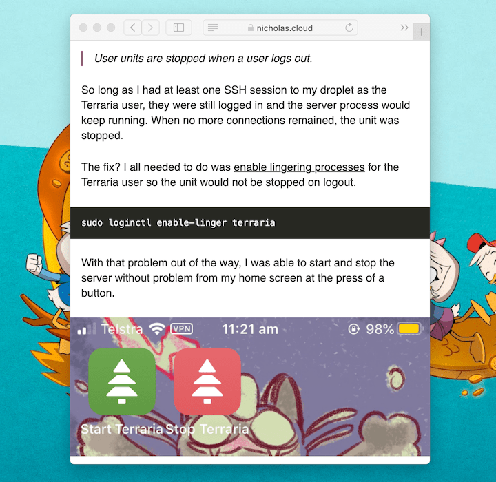

A while back, I wrote about the [inner workings of a neat CSS trick](../hiding-secret-links-with-css/) I spotted in use on a website. The world of software development is rife with these kinds of tricks, so why not look at more of them in another blog post?

I've gathered a few interesting fixes here to problems I've either encountered myself in web development, or seen others grapple with. So without further ado, let's jump into it!

<!--more-->

## Conditionally loading images in a static site

A consequence of my site being (largely) static is that I have a very little visibility over end clients. No matter who requests my website, they can expect largely the same experience whether they're using a 320px wide phone or a 1920px wide desktop monitor.

This poses a problem when it comes to adding behaviour that depends on the viewport size. In my case, I wanted to see if it was possible to only load my home page avatar on larger devices.

A quick solution would be to use a media query to hide the image when the viewport falls under a certain width, but this isn't ideal. Even though the image won't be displayed, it will still be requested as the browser parses the page's HTML.

```html


<style>
    @media (max-width: 599px) {
        #avatar {
            display: none;
        }
    }
</style>
```

If I had client-side JavaScript (whether vanilla or through a framework like React) it would be easy to put this logic behind an if/else depending on the `document.body.clientWidth`. If I was rendering responses on a server, I could get most of the way knowing a browser's user agent. When I'm just serving plain HTML/CSS though, I have to find other means.

Enter the `<picture>` element. It's designed to hint at alternative sizes and formats for an image, so browsers can choose the best fit. Now a browser will only load the image when the viewport is at least 600px wide!

```html
<picture>
    <source
        srcset="https://scrungus.club/img/scrungus.png"
        media="(min-width: 600px)"
    />
    
</picture>

<style>
    @media (max-width: 599px) {
        #avatar {
            display: none;
        }
    }
</style>
```

It's not good to leave the `src` attribute empty, so you can supply a small base64 encoded image if you want to keep everything valid. Either way, this image will not be displayed on smaller devices.

> _Aside: Another solution is to specify that the avatar image should be [lazy loaded](https://developer.mozilla.org/en-US/docs/Web/HTML/Element/img#attr-loading), but I wanted to see if there was an alternative way to do it._

## Placeholders for large media content

It's not uncommon these days to see news items and blog posts open with large hero images or stock photos. While they're a nice step to reduce the eyesore from a wall of text, large media can take a while to load on slower connections. Worse, it can lead to a jarring user experience if an image loads much later than other content and changes the layout of the page.


{}Image credit to [Kent C. Dodds](https://kentcdodds.com/blog/use-react-error-boundary-to-handle-errors-in-react) / [Debora Cardenas](https://unsplash.com/photos/yObRnRYfnmY){}

To solve this, placeholders are used to temporarily fill an image's space while it loads. When the original image finishes loading, it's changed out with the placeholder.

My favourite example of this is the [gatsby-image plugin](https://www.gatsbyjs.org/packages/gatsby-image/), which creates a smaller copy of the target image by either tracing an SVG version or by drastically shrinking its dimensions. This copy can then be base64 encoded and served inline with the main document.

This leads to a few neat benefits and considerations.

-   Inlined placeholders can be displayed immediately as the document is loaded, rather than waiting on a request.
-   It requires pre-processing, which is a great opportunity to consider serving resized images for devices with small viewports or low pixel densities.

## Removing empty CSS classes

When I changed the syntax highlighting on code blocks on my website to use a stylesheet rather than inline styles, I ended up with a [large file of CSS rules](https://github.com/nchlswhttkr/website/blob/182cf2c5e20cd741664dbcd6270d076b3cad9cb9/assets/highlight.css). While I could get rid of comments and whitespace with asset minification during a build, empty rules were not being cleaned up.

I cobbled together a little [sed](https://en.wikipedia.org/wiki/Sed) snippet to delete said rules after a successful build, and it's served me well ever since!

```sh
sed -i 's/[a-z.* ]*{}//g' public/highlight.min.css
```

This doesn't beat the tree-shaking capabilities that you might see in frameworks like Tailwind CSS with `purge`, but it's a neat little venture nonetheless.

## Working around framework constraints

Sometimes frameworks introduce constraints that can be troublesome for development. Today's example comes courtesy of [Can I Leave Melbourne](https://canileave.melbourne/) from [Terence Huynh](https://terencehuynh.com/), which uses NextJS to bring pre-rendering capabilities to a React app.

A concession that comes with this pre-rendering phase is that browser-based APIs like [native sharing in mobile clients](https://developer.mozilla.org/en-US/docs/Web/API/Navigator/share) aren't available, and accessing them can cause errors and a failed build. However, it is possible to make sure they're only accessed on the client side!

In the case of Can I Leave Melbourne, the fix was to [only access the API directly when inside a `useEffect()` hook](https://github.com/terencehuynh/can-i-leave-melbourne/blob/ffc0b6af65411d58bdb760a0b73b520d5c037c4b/components/Share.tsx#L37). It looks like these hooks aren't run during pre-rendering, so it avoids the error at build time. On a client's device though this hook _will_ be run, so they can use native sharing if it is available.

```tsx
// Copyright 2020 Terence Huynh

const [navigator, setNavigator] = React.useState<Navigator | null>(null);

React.useEffect(() => {
    setNavigator(window.navigator);
}, []);

const handleShare = async () => {
    const { title, desc: text, url } = SHARE_DATA;
    await navigator?.share({ title, text, url });
};
```

> _Aside: I think [opting out of pre-rendering for this section of the page](https://nextjs.org/docs/advanced-features/dynamic-import#with-no-ssr) might be another way to fix this, but with the tradeoff that the section will not show if a client isn't running JavaScript._

## Filling the screen width with CSS

These days, I usually prefer to use padding over margins to create space between elements, after I had a few rough run-ins with [margin collapsing](https://developer.mozilla.org/en-US/docs/Web/CSS/CSS_Box_Model/Mastering_margin_collapsing) in the past. For example, on this website I set `padding: 16px` on each section of the page to distance content from the edge of the viewport, rather than using left/right margins.

A downside of this is that I can't make images and code blocks naturally fill the width of the page. If I was using margins I could just set them to 0 on specified elements and I'd be all good. With padding though, these elements actually need to be _wider_ than their container allows. Here's an abridged version of the workaround I ended up with.

```css
.fill-page {
    max-width: calc(100% + 32px);
    position: relative;
    top: 0;
    left: 50%;
    transform: translate(-50%, 0);
}

.fill-page.code-block {
    width: calc(100% + 32px); /* Only force code blocks wider, not images */
}
```

The relative positioning shifts the selected elements right from their normal position by half the width of their _container_, while the transform moves them back by half the width of their _content_. With these rules combined, images and code blocks appear visually centred and fill the width of the container!



## What have you seen in the wilds?

That's a wrap! I hope you've enjoyed reading these quick dives, and that you're walking away knowing something new — be it knowledge of a new workaround or a sense of dread from all the weird things done in the name of development.

The world is full of mysterious fixes and magical bandages, and there's always something to be learned from taking a closer look. Better yet, there's always something to be shared too!
