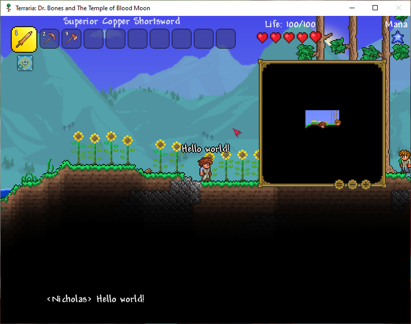
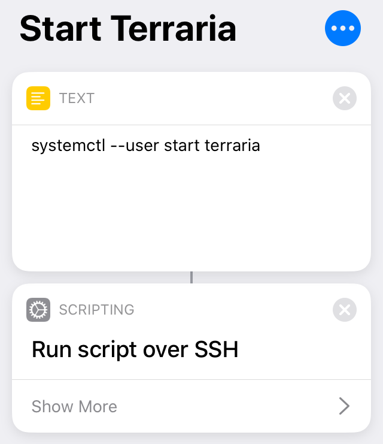
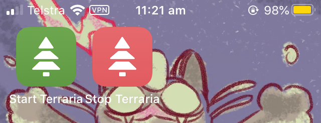

Recently, I had an interesting debugging session with my Terraria server, which I've been working to automate.

<!--more-->

This has been one of the more complex problems I've encountered and fixed, so I'm writing about it for others to learn from!

You can find the code to run the server like I did in [this Gist](https://gist.github.com/nchlswhttkr/53680d4abb106160fccd5fe820b23bd7), though I recommend only looking at it after you've finished reading.

---

At the moment, I pay US$5 for a Digital Ocean droplet (about ~AU$8 after conversion and taxes) to host my hobby projects. This includes my [personal website](https://nchlswhttkr.com), [Mellophone](https://mellophone.pink/), and a [Buildkite](https://buildkite.com/) agent. This droplet sees minimal traffic at the moment, and usually only sits at about 20-30% memory usage. I've been thinking about how to make greater use of this droplet for a while now.

As a challenge to myself, I decided to try hosting a Terraria server. I went with Terraria because of its minimal requirements (only 500MB of memory is needed, so I don't have to upgrade) and because I can test the connection easily with my Terraria client on Steam.

## Setting up the server

The first step was getting a server up, made easy because the Re-Logic team publishes a dedicated server distribution for Terraria. Before long, my droplet was running a server I could connect to, I was chugging along!



## The joys of automation

Since I didn't want to have an SSH session open while running the server, I set up a [screen](https://www.gnu.org/software/screen/) for the server to run in that I could attach to and detach from to run admin commands as needed. As a further step, I set this up as a [systemd](https://freedesktop.org/wiki/Software/systemd/) service, so that I could easily bring it up and down as I needed.

A key thing to note here is that the server was set up as a user unit to systemd, and not a system-wide unit. I went with this because I didn't want to make the user running my Terraria server a sudoer. User units behave similarly to normal units, except that they are managed by a single user, who can command them as needed (start, stop, enable, etc...) without root access.

## Automating it a bit further

So I decided to take it a bit further - what if I didn't even need to SSH into the droplet from my computer to start and stop the server?

With the release of iOS 12, Apple brought out [Shortcuts](https://apps.apple.com/us/app/shortcuts/id915249334), an rebrand of the automation app Workflow. One of the supported actions is the ability to "Run script over SSH" in a Shortcut. It supports password authentication and more recently (I noticed after upgrading to iOS 13.3) authentication through an RSA key. So what if I could start the server just by saying _"Hey Siri, Start Terraria"_?



<span class="center-text">_Yes, I still love my iPhone SE, Apple please drop iPhone SE 2_</span>

Initially this seemed to work fine, I could run the Shortcut and the server unit would start.

Except sometimes it didn't.

## Digging deep to debug

Sometimes the server would inexplicably shut down right after starting up. From what I could gauge, this shutdown was at least graceful, following the stop command I'd defined for the unit.


<span class="center-text">_Notice that the server starts up and shuts down in the space of a second_</span>

After investigating with some sleep statements, I realised that the server was not actually shutting down after starting up. It was shutting down _after my Shortcut script finished running_. This wasn't good, because I didn't think it would be possible to debug the problem if it was from some internal _Apple_ &copy; logic I didn't have visibility over.

Fortunately, at the point I also found out how the server startup failing to start only some of the time and not all of the time.

When I ran the "Terraria Start" Shortcut on my phone while also being SSH'd into the server on my computer, the server would successfully start up and not shut down. However, if the only active SSH session was from my phone when running the Shortcut, the server would start up and shut down immediately. I could finally reproduce the problem in full!

After some more unsuccessful debugging to try and disown any and all process related to the server unit and further researching, I noticed one key fact about user units that set them apart from what I was used to with system-level units.

> _User units are stopped when a user logs out._

So long as I had at least one SSH session to my droplet as the Terraria user, they were still logged in and the server process would keep running. When no more connections remained, the unit was stopped.

The fix? I all needed to do was [enable lingering processes](https://www.freedesktop.org/software/systemd/man/loginctl.html#enable-linger%20USER%E2%80%A6) for the Terraria user so the unit would not be stopped on logout.

```sh
sudo loginctl enable-linger terraria
```

With that problem out of the way, I was able to start and stop the server without problem from my home screen at the press of a button.



<span class="center-text">_Gigantamax Meowth is a longboi_</span>
