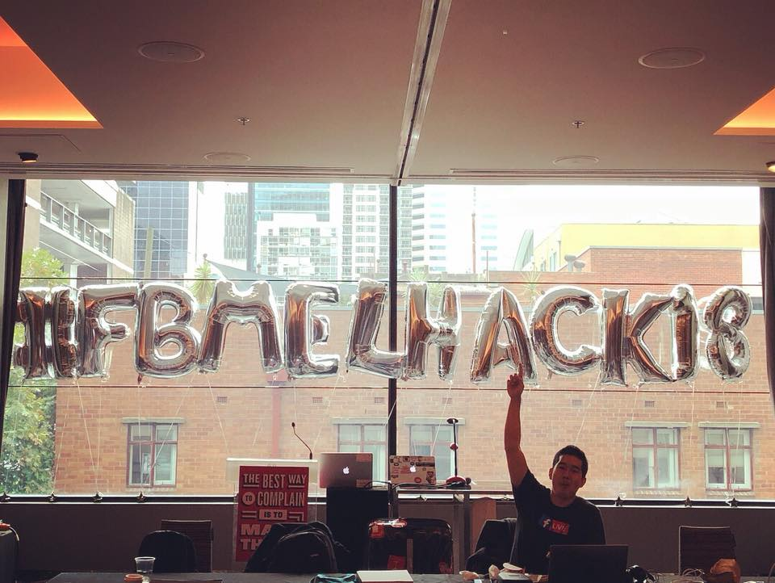
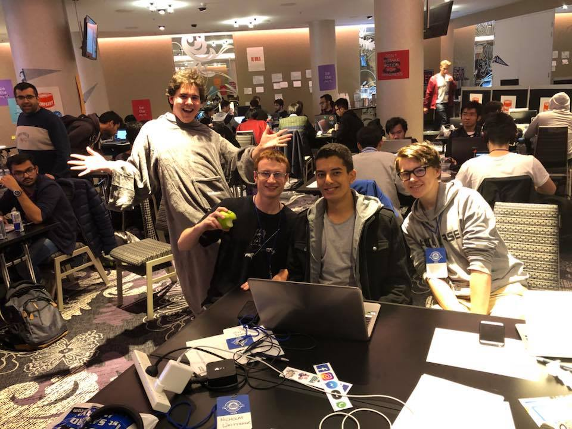
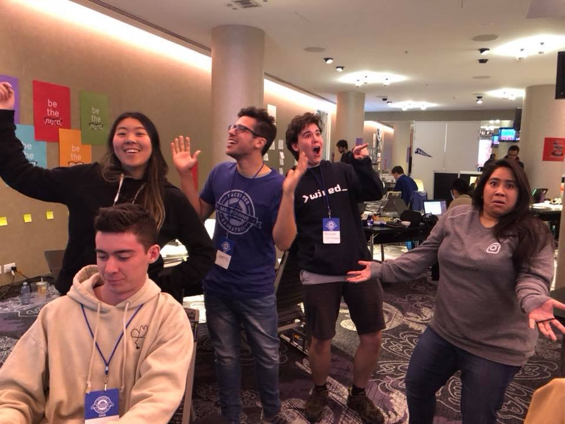
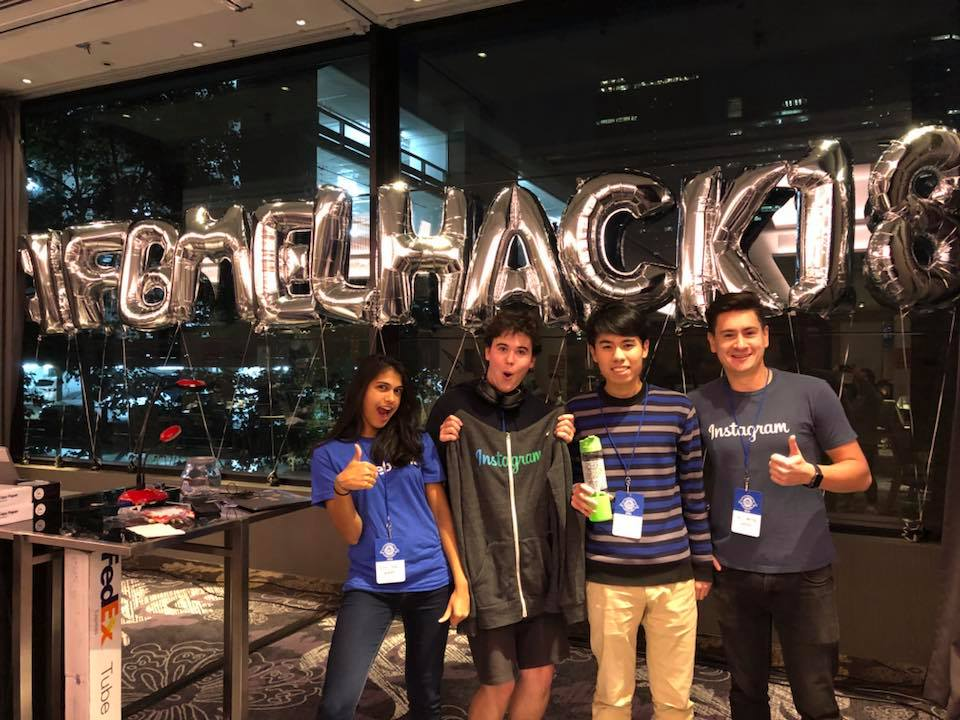

This past weekend I had the pleasure of attending Facebook’s 2018 Regional Hackathon in Melbourne!

<!--more-->

Teaming up with my good friend Patrick, we went in as a pair and a welcoming attitude for those without a team. In the end, we teamed up with Tij, another CS student at Monash, as well as Hugh from Melbourne University.

{}Team Java Binks: Myself, Patrick, Tij, and Hugh{}

We ended up building an application to make it easier for small committees and organisations to run social media campaigns, by shifting all the focus to a single central service. Our goal was to reduce the effort needed to run automated posts across multiple platforms (Facebook, Twitter, etc…). We also ended up extending this by generating a weekly newsletter that could then be sent out.

I ended up working largely on front-end, building an interface for adding/editing items with React, while Tij and Hugh worked to post items through the Facebook and Gmail APIs in Python, and Patrick jumped between the two areas.

Over the course of the event, we ended up setting up a front-end with a simple back-end (json-server is a life-saver!), as well as successfully sending out posts on Facebook and over Gmail. While we weren’t able to get a full service up and running, and the Twitter API proved to be a bit too much to handle, we were pretty chuffed with the ground we’d covered over the course of the event.

In the end, our pitch went well and while we didn’t take out any prizes, we all felt proud of what we’d accomplished in just 24 hours.

{}Posing with Grace, Curtis and Bambi{}

## What I learned from #fbmelhack18

-   Don’t be afraid to **join up with strangers** for the event! More often than not, they’re just participants looking to make the most of the experience, and there’s certainly no harm in being accommodating!
-   Focus on building your product **from the ground up**. It’s incredibly easy to build on a simple idea and expand it to something greater later. When you begin with something large-scale, you’re only going to find yourself cutting it to pieces in the hours before the “hacking stop” deadline to ensure you’re ready to present.
-   **Socialise** with other participants! Hackathons are where people from all assortments of backgrounds come together to build and compete. You’re sure to learn something from speaking to all the other attendees, and you might end up making a few new friends along the way!

You can find a copy of our repo for the hack on [GitHub](https://github.com/nchlswhttkr/fbmelhack18/)!

The next hackathon on the calendar for me is [UNIHACK](https://unihack.net/), and it’s safe to say I’m looking forward to more freebies, fun, and hopefully a win!

{}As well as a Facebook snuggie, I ended up winning an Instragram hoodie in the raffle!{}
