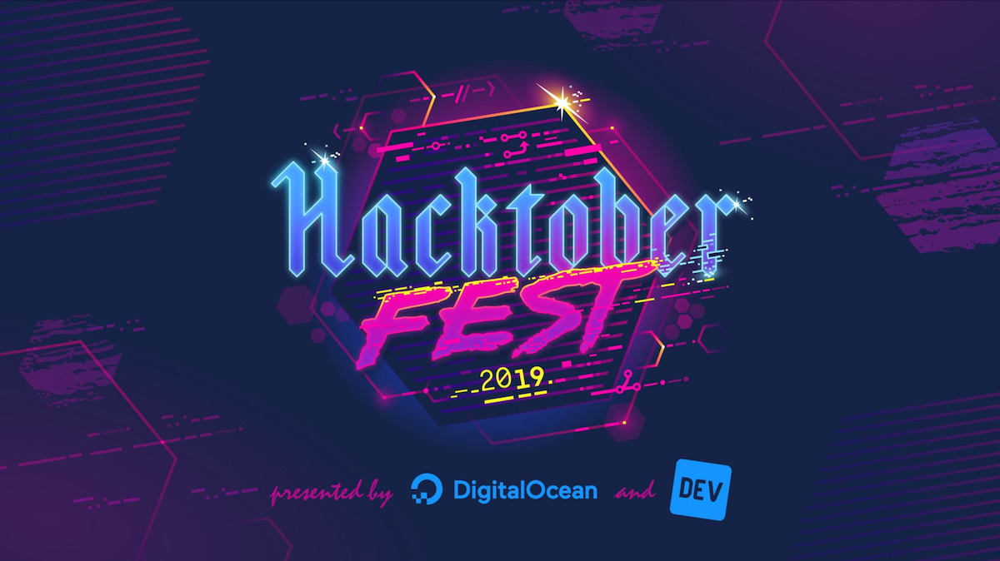
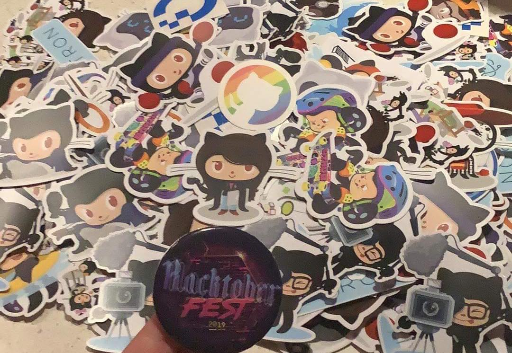

Last week I had the opportunity to run a workshop with at Monash University in celebration of [Hacktoberfest](https://hacktoberfest.digitalocean.com). The night itself focused on exploring open source software development. Exploring what open source software is, the implications it has for the world of software development and IT systems, and how contributions can be made. We also had a little security spin, examining how projects that are open source make tradeoffs in security.

You can find out the full rundown on the event at the [workshop site](https://nchlswhttkr.github.io/hacktoberfest-2019/about).

<!--more-->

## Thanks and Support

First of all it can't go without mention that this event would not have been possible without the support of [MonSec](https://monsec.io) in organising a room and managing logistics, and the support of [WIRED Monash](https://wired.org.au) in covering food costs on the night.

With the help from the Melbourne tech community, we ended up with literal kilograms of stickers on hand to pass out to students, as well as plenty of Git guides/resources to help them polish up any rusty Git skills. These came courtesy of GitHub and GitHub Community Manager [Michelle Mannering](https://twitter.com/MishManners). It was all lent to me from the awesome team at [JuniorDev](https://juniordev.io), leftovers from when they ran their own Hacktoberfest workshop earlier in the month.

A last shoutout also goes to the Draga and April for promoting the workshop in the IT Faculty and DiversIT newsletters respectively.

## Preparation

I'd been considering running a Hacktoberfest event at Monash since around the start of the semester. However in between the flood of work in a university semester and several other major events in July/August (Tutoring at Monash's programming bootcamp, the VBL State Championships, the Bit by Bit Hackathon with WIRED and DDD Melbourne), the idea got lost in the currents for a while.

The thought resurfaced in early October, just after Hacktoberfest kicked off. So I set about organising and reaching out around Monash. Fortunately, MonSec runs weekly workshops and were looking for potential ideas when I spoke with them.

Just like that, a Hacktoberfest event was scheduled for next week, Monday the 14th. There'd still be weeks after the workshop ran for participants to get their four contributions in and earn a shirt.

It was just a week later though. Only seven days away. I had my work cut out for me!

The first few days were spent confirming details and creating an event to promote to the student body. On the Thursday prior I started getting the workshop content together.

Amidst assignment work, it wasn't until the weekend (and the day of) that I was able to get a full presentation together, as well as a guide to help students make their pull requests.

In the end up I was very happy with the final event site. Attendees could contribute their details by adding their own file, a setup I intentionally went with to avoid dealing with merge conflicts. With the use of GitHub Actions I could also have changed deployed in the space of minutes!

My goal was to create a project where contributions were easy to make, and had super fast feedback (an updated attendee list). The automated approach also meant I didn't need to spend long merging pull requests as attendees made them!

I was similarly satisfied with the presentation slides. They covered the basics of open source and Hacktoberfest, showed how to go about contributing to a project, and had a security-flavoured twist that I hope captured the interest of MonSec members.

## Execution

There were a few technical and non-technical difficulties when it came presenting on the day.

I lost the dongle to connect my computer to the presenting lecturn (later found!). The screen-mirroring software I used crashed several times when opening links to a new browser page from the presentation slides. I also couldn't use my presenter notes while mirroring. On the bright side, I was at the very least able to use the screen-mirroring software (a 32-bit app) since I hadn't upgraded to MacOS Catalina.

As a presenter, I felt I was engaging my audience, but that I didn't quite have the usual smoothness and sense of direction that I makes me feel comfortable. In hindsight, I could have lessened this with a practice runthrough, or by sitting down with a friend to review my slidedeck.

It would have been good to get a gauge of the audience's Git skills before I started speaking. The [contributing guide](https://nchlswhttkr.github.io/hacktoberfest-2019/contribute) I prepared on the workshop site used Git CLI, whereas I feel more people would have been comfortable with GitHub Desktop or GitKraken.

For the live demonstration, I made the impromptu decision to do everything on GitHub itself.

It paid off, as GitHub makes it easy to fork a repository, commit a single file, and make a pull request back upstream. This is what most attendees ended up doing.

_I wasn't lying about a kilogram of stickers!_

That's just about a wrap on everything I wanted to talk about. I hope you've been able to pick up something away from my own reflections! Thanks for reading!

---

### Debugging deployments to GitHub Pages

_A little offhand thing I learned as well..._

When using GitHub Actions to deploy to GitHub Pages, the usual strategy is to push build artifacts to a `master` or `gh-pages` branch.

If you use the provided `secrets.GITHUB_TOKEN` in a token-based approached to push to GitHub, the Pages deployment will fail. You will get a very nondescript "GitHub Pages deployment failed" error message.

From what I can gleam, this is because this specific token [does not have the permissions to launch a new job](https://github.community/t5/GitHub-Actions/Github-action-not-triggering-gh-pages-upon-push/m-p/27454/highlight/true#M302) that deploys to GitHub Pages.

Thankfully the workaround is [minimal](https://github.com/nchlswhttkr/nchlswhttkr.github.io/commit/505685a32c8486ceb22a12b896303ccd1ed15acb), and you can replace the provided token with one you [generate yourself](https://github.com/settings/tokens).
