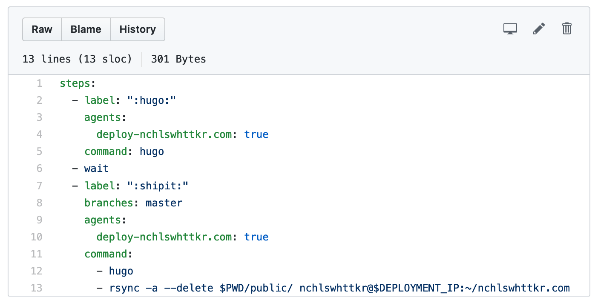
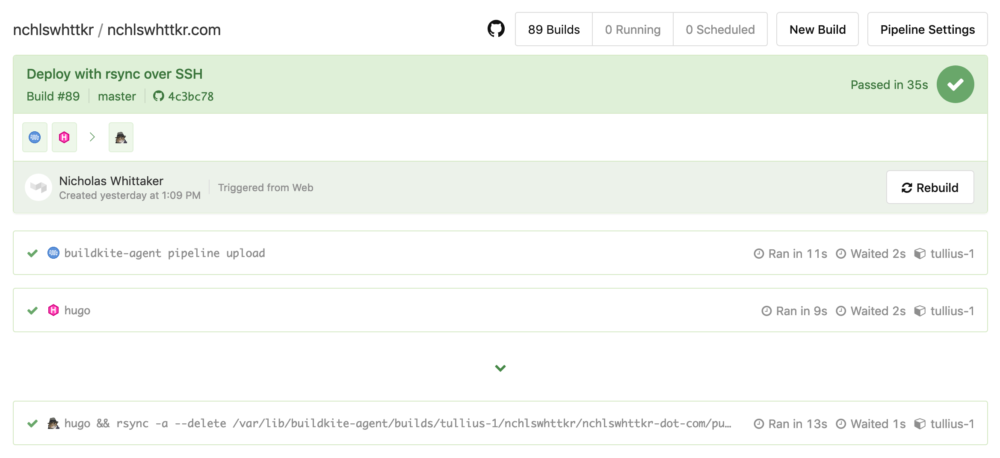
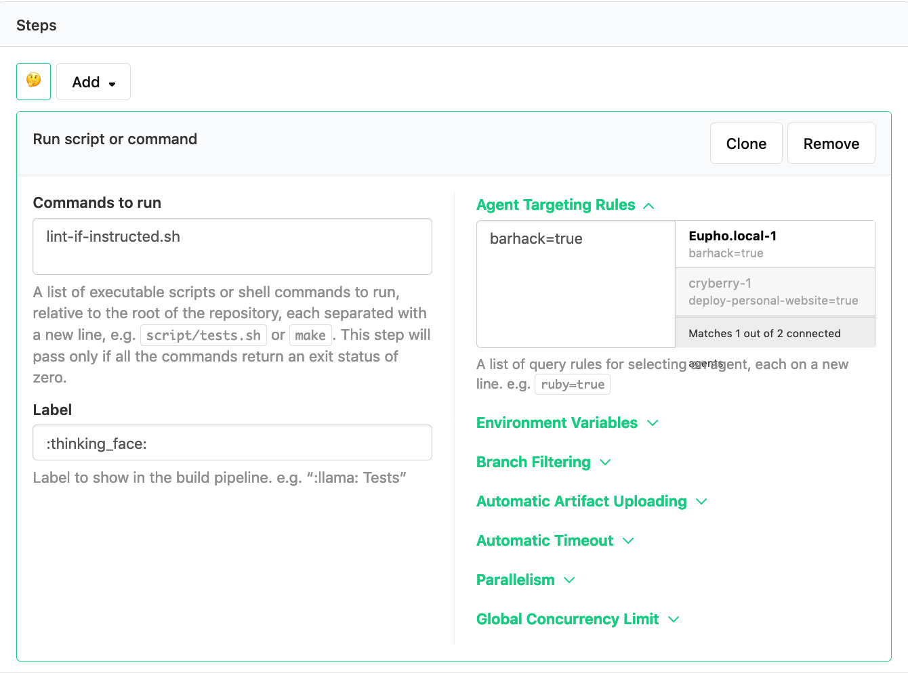
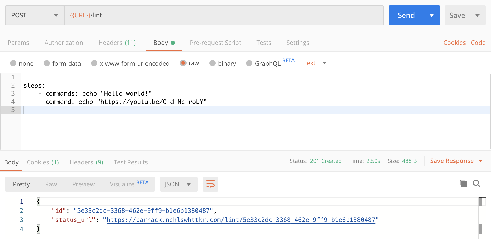

So I've been using [Buildkite](https://buildkite.com) a bit lately and loving it. Last weekend I had the thought of building a service to validate the `pipeline.yml` files it uses for configuration.

<!--more-->

> _**Forenote**_
>
> After wrapping up and doing further investigating, I found out that the Buildkite team have published a [JSON schema for pipeline files](https://github.com/buildkite/pipeline-schema) that can be used for validation.
>
> I've added that as [an option on my service](https://github.com/nchlswhttkr/barhack#usage).



It's similar to an offering from GitLab with their [CI lint](https://gitlab.com/ci/lint) tool, which can validate your `.gitlab-ci.yml` files, and I thought it would be a good challenge to implement.

So I started [cobbling a little something together](https://github.com/nchlswhttkr/barhack) while I was on my bar shift for my bowls club. Being the Sunday evening after the end-of-season party the crowd was quite light on, affording me the time to dabble around and to get building.

## To start, some terminology

Buildkite can be used to set up all kinds of automated processes, usually in relation to the code you develop at work or on a hobby project.

These processes are called _pipelines_, and each pipeline is tied a Git repository. Buildkite listens for events from this repository, such as when code is pushed or a pull request is opened.

When these events happen, a _build_ is started. Each build follows a series of _steps_. The steps for a build are determined by which pipeline it belongs to.

There are different types of steps. The one I'll be focusing on is the command step, which specifies the configuration and script for a _job_. Other types of steps can wait for previous steps to succeed before allowing further steps to run, or block the build until a user unblocks it from Buildkite's UI. I won't be focusing on these though.

Jobs are single purpose pieces of work, much like a script or command you'd run locally on your machine. A job might check that code meets a style guide, run tests, or deploy to a production/staging environment. When the script for a job finishes successfully, the job has passed. When all the jobs for a build pass, the build itself passes.

Jobs are executed by _agents_, job runners provided [open source from Buildkite](https://github.com/buildkite/agent) to host on your servers/architecture. With a large number of agents many jobs can be run concurrently, with each agent running its assigned job and reporting the results back to Buildkite.

During a build's runtime, further jobs can be added. A common job is a [pipeline upload](https://buildkite.com/docs/agent/v3/cli-pipeline), where the agent searches for a pipeline file in the source code of a repository. This pipeline file declares a set of jobs that can be added to the current build.

As an example, here's the pipeline for [my website](https://source.nchlswhttkr.com) and a recent build from it.



{}Don't worry too much about the syntax, just see how it defines two steps, each with a set of commands.{}

1. The Buildkite agent looks for a pipeline file to upload, and finds `.buildkite/pipeline.yml`. \
   Uploading this file creates two more jobs.
1. The first of these new jobs attempts to build my site using [Hugo](https://gohugo.io).
1. The second job builds (each job runs in a clean checkout of the repository) and deploys my website. \
   The chevron/arrow denotes that this job will only run after all previous jobs have succeeded. This is a wait step, and it stops the deploy step from running if a prior job fails.



There are further features to Buildkite, like requiring specific conditions for a job to run, but that's not what I'll be focusing on with this piece.

## Coming up with a rough design

The first step was deciding how to examine a provided pipeline file to determine whether it was valid.

One option was to build a parser which could inspect [each step](https://buildkite.com/docs/pipelines/defining-steps) of the pipeline file for mistakes in syntax. The catch here would be in understanding the complete syntax of a pipeline file, along with complex cases that might arise with larger pipelines or features like [conditional steps](https://buildkite.com/docs/pipelines/conditionals).

Another option was to upload the pipeline file within a running build. This would avoid any work in parsing the pipeline file, since the Buildkite agent would do it instead. However, it would take much longer to run, as a tradeoff for parsing the file. I'd need to kick off a build, and use the result to infer whether the upload had succeeded or not.

I decided to go with the latter, since getting feedback about a pipeline's validity from Buildkite itself seemed the smarter choice.

## Proof of concept

To start, I set up a job in my pipeline that would try to upload a `pipeline-to-lint.yml`.

If uploading succeeded the job would then call the Buildkite API to cancel the current build, in order to prevent the newly-uploaded jobs from running and wasting resources. If the job failed and exited while uploading, a [post-command hook](https://buildkite.com/docs/agent/v3/hooks) would catch this and record a failure.

To persist this information beyond the lifetime of a build, I ended up writing the validation status to a text file on the server hosting the agent. As a build starts, this status would be `PENDING`, and later turn to `PASSED` or `FAILED` after the build had run.


{}Validation in this pipeline succeeds, and the rest of the build is cancelled.{}


{}Validation in this pipeline fails, and no further jobs are run.{}

## Doing a bit better!

At that moment, I needed to run two jobs before knowing whether the target pipeline file was valid. This was something to improve upon.

First, there was an initial job that spawned our validation job, reading from `./buildkite/pipeline.yml`. Our newly-created validation job that checked the `pipeline-to-lint.yml` was then run after this.

By including the validation script as an initial step for the pipeline, rather than specifying it in the `pipeline.yml` file, I could avoid needing the first job entirely! Running one less job also had the benefit of shaving build time roughly in half!



This also fixed a subtle bug that came from running more than one job. After the first pipeline uploading job had finished, the `post-command` hook would run and mark the status as `FAILED`. Shortly after, the validation job would run and correct this if the `pipeline-to-lint.yml` was actually valid, but for a brief moment a passing file would have a failed status.

## Making it more flexible

Our validation job also expected that the `pipeline-to-lint.yml` be checked in with the rest of source code. Needing to make a commit each time to run validation was a bit wasteful. So I started using the Buildkite API to trigger builds, instead of just pushing to GitHub.

When starting builds from Buildkite's API or web UI, you're able to specify different environment variables that can overwrite the defaults for your pipeline. Lo and behold, it was now possible to provide arguments that could change with each build!

With this set up, I could now load the target pipeline file onto my server, use an environment variable (`BARHACK_LINT_ID`) to tell the agent where to find the file and where to record results, and kick off a build.

```sh
curl -H "Authorization: Bearer $BUILDKITE_TOKEN" \
    -X POST "https://api.buildkite.com/v2/organizations/nchlswhttkr/pipelines/barhack/builds" \
    -d '{
        "commit": "HEAD",
        "branch": "lint",
        "env": {
            "BARHACK_LINT_ID": "5e33c2dc-3368-462e-9ff9-b1e6b1380487"
        }
    }'
```

At this point it's worth noting that since jobs can be executed concurrently across agents on different servers, you can't always be certain that the same agent will always run your build. I resolved this by using [agent targeting](https://buildkite.com/docs/agent/v3/cli-start#agent-targeting) to ensure that builds would always run on my chosen agent.

## Exposing it to the web

Now that I could validate a provided file and save the result, it was time to make an application over the top. This would be for end users to upload their file and to view the result, as well as something to prepare and kick off a build. I had a pretty good idea of the process I wanted now, having already built the functionality I needed.

-   A client uploads their `pipeline.yml` file.
-   This file is stored, and a build is initiated to validate it.
-   A client can check the status of their file validation.

So I went ahead and chucked together a quick server with [hapi](https://hapi.dev) to accept a file upload, kick off the build, and show the validation status. Thankfully, Nginx's support for [Basic authentication](https://docs.nginx.com/nginx/admin-guide/security-controls/configuring-http-basic-authentication/) made it easy to limit access to this API so only I could upload a file.



{}Uploading a pipeline with two steps to be validated.{}

Looking within Buildkite, a build was kicked off, and later cancelled when the pipline upload succeeded. The pipeline was valid!


Checking the status in our API also shows that validation passed!

```sh
curl -H "Authorization: Basic <my-auth-details>" "https://barhack.nchlswhttkr.com/lint-with-build/5e33c2dc-3368-462e-9ff9-b1e6b1380487"
# {"status": "PASSED"}
```

So there you have it, a service that validates your Buildkite pipeline files!

You can find all the code this little project on [GitHub](https://github.com/nchlswhttkr/barhack)!

## Further steps?

A thought I also had was to try uploading the pipeline steps to Buildkite directly with an [API call](https://buildkite.com/docs/apis/rest-api/pipelines#update-a-pipeline). I didn't end up going with this because it would involve parsing the `pipeline.yml` file, which I think negates the purpose of this exercise.

My initial search didn't turn up any information on whether Buildkite offers this kind of validation as a feature, but I'd be surprised if it isn't already available in some form. It calls for further investigation!
